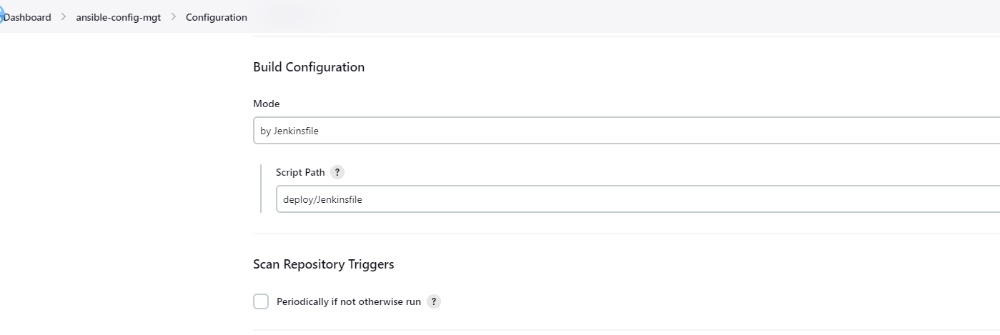
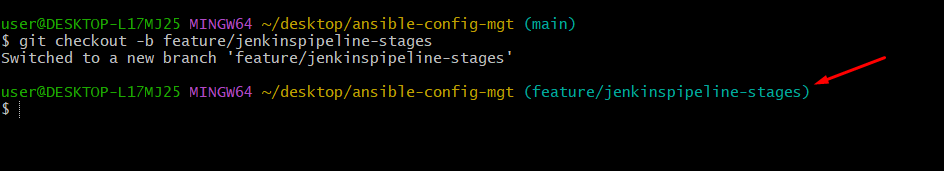

## CONTINUOUS INTEGRATION WITH JENKINS | ANSIBLE | ARTIFACTORY | SONARQUBE | PHP


On your Jenkins-server that you created Install Jenkins


 - Open the terminal. Go to the directory where you want to create your script.
 - Create a file with .sh extension.
 - Write the script in the file using an editor.
 - Make the script executable with command chmod +x <fileName>.
 - Run the script using ./<fileName>.

```
#!/bin/bash
# jenkins installation script
# update the server repository
sudo apt update -y
# This is the Debian package repository of Jenkins to automate installation and upgrade. To use this repository, first add the key to your system:
curl -fsSL https://pkg.jenkins.io/debian-stable/jenkins.io-2023.key | sudo tee \
    /usr/share/keyrings/jenkins-keyring.asc > /dev/null
# Then add a Jenkins apt repository entry:
echo deb [signed-by=/usr/share/keyrings/jenkins-keyring.asc] \
    https://pkg.jenkins.io/debian-stable binary/ | sudo tee \
    /etc/apt/sources.list.d/jenkins.list > /dev/null
# Update your local package index, then finally install Jenkins:
sudo apt-get update -y
sudo apt-get install fontconfig openjdk-11-jre -y
sudo apt-get install jenkins -y
echo "Jenkins installation successfull"
# Unlock Jenkins
sudo cat /var/lib/jenkins/secrets/initialAdminPassword

```

By default Jenkins server uses TCP port 8080 - open it by creating a new Inbound Rule in your EC2 Security Group


#### Configuring Ansible For Jenkins Deployment

1. Install & Open Blue Ocean Jenkins Plugin -> Manage Jenkins -> Plugins -> Available Plugins -> Blue Ocean


#### Get personal access token from github by creating new one and copy it

Go to your GitHub Account, -> Settings -> Developer Settings -> Personal Access Token -> Tokens (classic)


 Add the code snippet below to start building the Jenkinsfile gradually. This pipeline currently has just one stage called Build and the only thing we are doing is using the shell script module to echo Building Stage.

 ```
 pipeline {
    agent any

  stages {
    stage('Build') {
      steps {
        script {
          sh 'echo "Building Stage"'
        }
      }
    }
    }
}
 ```


- Specify buildpath to help jenkins locate jenkinsfile --> ansible-config-mgt -> Configuration -> Build Configuration







## RUNNING ANSIBLE PLAYBOOK FROM JENKINS

